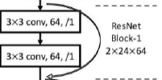
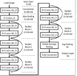
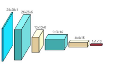
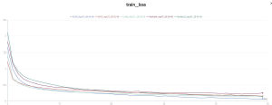
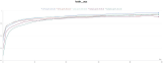

# 深度学习第一次作业

## 作业任务

使用 FashtionMNIST 数据集，训练若干模型，进行分类任务。 

## 数据集说明

采用数据集 FashionMNIST ，一个图像分类入门级的数据集，其中包含 10个类别的 70000 个灰度图像。每个图像的尺寸为 28*28。另外，训练数据集长度60000，测试集长度 10000。 

## 模型作业任务

使用 FashtionMNIST 数据集，训练若干模型，进行分类任务。 

### 数据集说明

采用数据集 FashionMNIST ，一个图像分类入门级的数据集，其中包含 10个类别的 70000 个灰度图像。每个图像的尺寸为 28*28。另外，训练数据集长度60000，测试集长度 10000。 

## 模型说明

**残差神经网络的基本框架**：由两个卷积神经网络构成。对输入特征进行两次卷积操作以后，加上原来的输入特征，能够有效减少梯度消失的问题。如果输入输出特征的后两个维度不同，可以用卷积操作将输入特征进行一层加工使其维度匹配再加入。



**ResNet12 框架**：输入维度为[batch_size, 1, 28, 28]，经过一层卷积层后变为[batch_size, 3, 14, 14]，然后经过 5 次 ResNetBlock，最后展开全连接得到结果。



**ResNet4 框架**：输入维度为[batch_size, 1, 28, 28]，经过一层卷积层后变为[batch_size, 3, 14, 14]，然后经过 1 次 ResNetBlock，最后展开全连接得到果。

**LeNet 框架**：输入维度为[batch_size, 1, 28, 28]，经过一个卷积层、maxpool下采样、卷积层，最后展开做一个全连接层构成。



**MLP2 框架**：输入维度为[batch_size, 1, 28, 28]，然后展开作 2 次全连接层，输出维度是[batch_size, 10]。

**MLP5 框架**：输入维度为[batch_size, 1, 28, 28]，然后展开作 5 次全连接层，输出维度是[batch_size, 10]。 

## 参数设定

Lr: 0.01

Batch_size: 10000

Device: cuda

Epochs: 50

## 训练流程

优化器选择 Adam，损失函数选择交叉熵损失。每轮训练成果输出到终端，并使用 swanlab 保存到 logs 文件夹的日志中。 

## 训练成果

使用 train.py 文件分别对 5 种模型进行训练。训练过程如下：



由图可知，各种模型在第 10 个 epoch 前 loss 均大幅下降，随后平稳下降。其中 MLP2 结构下降最快，MLP5 模型最终 loss 最小。



由图可知，在模型结构相似情况下，层数越多，模型越深，最终准确率越高。使用 predict.py 文件选择 LeNet 模型进行预测，成果如下：优化器选择 Adam，损失函数选择交叉熵损失。每轮训练成果输出到终端，并使用 swanlab 保存到 logs 文件夹的日志中。 

## 代码使用

### 训练命令

终端命令：

```shell
python train.py
```

在文件中修改需要训练的模型

### 预测命令

终端命令：

```shell
python predict.py  --device cuda  --model LeNet
```

--device: device

--model: model name: [ResNet12, ResNet4, LeNet, MLP2, MLP5]